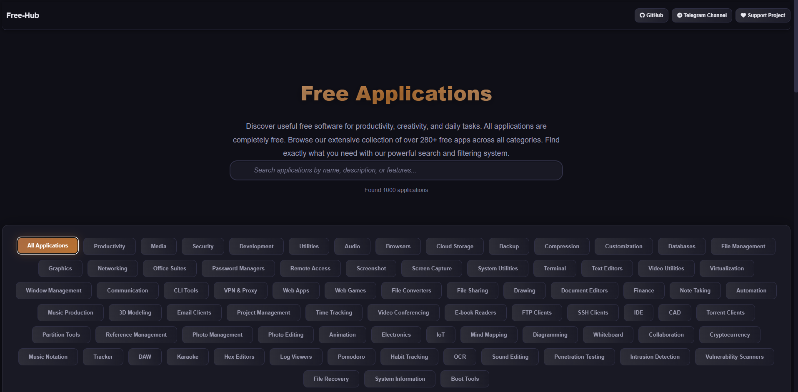

  

# Free-Hub - Free Applications Catalog

### [>> Website <<](https://free-hub.pages.dev/)
### [>> Website (Alternative Link) <<](https://waratecs123.github.io/Free-Hub/)

Free-Hub is a comprehensive web application that serves as a curated catalog of over 999+ completely free software applications across various categories. The platform is designed to help users discover valuable free software for productivity, creativity, development, security, and daily computing tasks.

## Features

### Intelligent Search & Filtering
- **Advanced Search**: Search applications by name, description, or features with real-time results
- **Comprehensive Filtering**: Filter applications across 60+ categories including:
  - Productivity & Development Tools
  - Media & Graphics Software
  - Security & Privacy Applications
  - Audio & Video Utilities
  - System & Network Tools
  - Cloud Storage & Backup Solutions
  - And many more specialized categories

### Screenshot

  

### Application Details
Each application includes:
- **Rating System**: 4.0-5.0 star ratings based on community feedback
- **Platform Information**: Clear indication of supported operating systems
- **Detailed Descriptions**: Comprehensive feature overviews
- **Feature Tags**: Quick-view tags highlighting key capabilities
- **Direct Download Links**: One-click access to official download sources

### Modern User Interface
- **Dark Theme**: Eye-friendly dark color scheme with orange accents
- **Responsive Design**: Fully responsive layout for all device sizes
- **Smooth Animations**: Fade-in effects and hover interactions
- **Visual Feedback**: Glow effects and transitions for better user experience

## Technical Architecture

  

### Frontend
- **HTML5**: Semantic markup structure
- **CSS3**: Modern styling with gradients, flexbox, and grid layouts
- **JavaScript**: Vanilla JS for dynamic functionality without external dependencies
- **Font Awesome**: Icon library for visual elements
- **Responsive Design**: Mobile-first approach with breakpoints

### Key Technical Features
- **Client-side Filtering**: Instant filtering without page reloads
- **Search Optimization**: Multi-field search across name, description, and features
- **Category Management**: Dynamic category system with active state tracking
- **Performance Optimized**: Minimal dependencies and efficient rendering

## Use Cases

### For End Users
- Discover free alternatives to paid software
- Find specialized tools for specific tasks
- Access vetted, safe download links
- Compare features across similar applications

### For Developers
- Reference implementation of client-side filtering
- Example of vanilla JavaScript application architecture
- CSS design patterns for modern web applications
- Data management patterns for static web apps

## Some Applications from the List

| Name | Description | Platform | Tags |
|------|-------------|-----------|------|
| [VLC Media Player](https://www.videolan.org/vlc/) | Versatile media player that can play almost any video or audio format including DVDs, Audio CDs, VCDs, and various streaming protocols. Supports custom filters, subtitles synchronization, video effects, and advanced audio processing. | Windows/Mac/Linux | All Formats, Free, Open Source, Lightweight, Streaming, Subtitles, DVD Support |
| [LibreOffice](https://www.libreoffice.org) | Complete office suite compatible with Microsoft Office documents. Includes Writer for word processing, Calc for spreadsheets, Impress for presentations, Draw for vector graphics, Base for databases, and Math for formula editing. Regular updates and strong community support. | Windows/Mac/Linux | Word Processor, Spreadsheets, Presentations, Free, Open Source, Compatible, Multiple Languages |
| [GIMP](https://www.gimp.org) | Powerful image manipulation program similar to Photoshop with professional-grade features. Includes photo retouching, image composition, digital painting, and extensive plugin support. Supports layers, masks, filters, and various file formats. | Windows/Mac/Linux | Photo Editing, Digital Art, Open Source, Free, Layers, Plugins, Professional Tools |
| [Visual Studio Code](https://code.visualstudio.com) | Lightweight but powerful source code editor from Microsoft with IntelliSense, debugging, Git integration, and thousands of extensions. Supports virtually all programming languages and frameworks with excellent performance and customization options. | Windows/Mac/Linux | Code Editor, Extensions, Git Integration, Free, Debugging, IntelliSense, Multi-language |
| [7-Zip](https://www.7-zip.org) | File archiver with high compression ratio and support for many formats including 7z, ZIP, RAR, TAR, GZIP, and more. Features strong AES-256 encryption, integration with Windows shell, and command-line version for advanced users. | Windows | File Compression, High Ratio, Multiple Formats, Free, Encryption, Open Source, Shell Integration |
| [OBS Studio](https://obsproject.com) | Free and open source software for video recording and live streaming with professional features. Supports multiple sources, scenes, transitions, and real-time audio/video mixing. Popular with gamers, streamers, and content creators. | Windows/Mac/Linux | Screen Recording, Live Streaming, Open Source, Free, Multiple Sources, Real-time, Professional |
| [Bitwarden](https://bitwarden.com) | Open source password manager that stores sensitive information securely with end-to-end encryption. Features cross-platform sync, password generator, secure sharing, and self-hosting option. Regularly audited for security. | All Platforms | Password Manager, Secure, Open Source, Free, Cross-platform, Encryption, Audited |
| [Audacity](https://www.audacityteam.org) | Easy-to-use, multi-track audio editor and recorder for Windows, macOS, GNU/Linux and other operating systems. Features include recording, editing, effects, noise reduction, and support for various audio formats. | Windows/Mac/Linux | Audio Editing, Recording, Open Source, Free, Multi-track, Effects, Noise Reduction |
| [Bruno](https://www.usebruno.com/) | Tests APIs with Git version control integration and offline-first design. Features include team collaboration, environment variables, support for multiple authentication methods, and local data storage for privacy. | Windows/Mac/Linux | API Testing, Git Integration, Open Source, Free, Offline-first, Collaboration, Local Storage |
| [Hoppscotch](https://hoppscotch.com/) | Tests APIs with real-time collaboration features in a lightweight, fast, and open-source alternative to Postman. Works directly in your browser with no installation required and supports all major HTTP methods. | Web | API Testing, Collaboration, Real-time, Free, Browser-based, Open Source, Lightweight |
| [Postman](https://www.getpostman.com/postman) | Tests APIs with automated test scripts and monitoring capabilities. Features include collections, environments, mock servers, documentation, team workspaces, and extensive testing capabilities with JavaScript. | Windows/Mac/Linux | API Testing, Automation, Monitoring, Free, Collections, Mock Servers, JavaScript Testing |
| [Flow Launcher](https://flowlauncher.com/) | Searches files and launches apps with plugin extensibility and fast keyboard navigation. Includes web search, calculator, unit converter, system commands, and highly customizable interface with themes. | Windows | App Launcher, File Search, Plugins, Free, Fast, Customizable, Themes |
| [ueli](https://ueli.app/#/) | Powerful keystroke launcher for Windows with extensive customization options. Features include web search, calculator, color converter, custom commands, and system controls with minimal resource usage. | Windows | App Launcher, Keyboard Shortcuts, Fast, Free, Web Search, Calculator, System Controls |
| [Foobar2000](https://www.foobar2000.org/) | Plays audio with extensive customization options and advanced audio processing. Supports all major audio formats, gapless playback, ReplayGain, advanced tagging, and component-based architecture. | Windows | Audio Player, Customizable, Lightweight, Free, Gapless Playback, Advanced Tagging, Components |
| [Mixxx](https://mixxx.org/) | Mixes music for DJs with professional features including beat matching, sync, effects, EQ, crossfader, and support for various DJ controllers. Great for both beginners learning to mix and professional DJs. | Windows/Mac/Linux | DJ Software, Music Mixing, Open Source, Free, Beat Matching, Effects, Controller Support |
| [Firefox](https://firefox.com) | Browser with strong privacy features and extensive customization options. Features include tracking protection, container tabs, extensive add-ons library, developer tools, and regular security updates. | Windows/Mac/Linux | Web Browser, Privacy, Customizable, Free, Tracking Protection, Add-ons, Security |
| [Brave](https://brave.com) | Privacy focused browser with built-in adblock and tracking protection. Blocks ads and trackers by default, includes Tor windows for private browsing, and rewards users with Basic Attention Tokens. | Windows/Mac/Linux | Web Browser, Privacy, Ad Blocking, Free, Tor Integration, Chromium-based, Rewards |
| [Tor Browser](https://www.torproject.org/) | Privacy browser routing traffic over the Tor network to protect against surveillance and censorship. Features include NoScript, HTTPS Everywhere, fingerprinting resistance, and regular security updates. | Windows/Mac/Linux | Web Browser, Privacy, Anonymous, Free, Tor Network, Anti-fingerprinting, Censorship Resistance |
| [Mega](https://mega.nz/) | Encrypts files before they leave your device with end-to-end encryption. Offers 20GB free storage, file versioning, secure chat, and strong focus on privacy and security with client-side encryption. | All Platforms | Cloud Storage, Encrypted, Secure, Free, End-to-end, 20GB Free, File Versioning |
| [Proton Drive](https://proton.me/drive) | End-to-end encrypted cloud storage from Proton with integration with Proton Mail and Calendar. Swiss-based with strong privacy laws, zero-access encryption, and offers 1GB free storage. | All Platforms | Cloud Storage, Encrypted, Private, Free, End-to-end, Swiss-based, Zero-access |
| [PeaZip](https://peazip.github.io/) | Archive manager with compression format support for over 200 archive and compression formats. Features strong encryption, file splitting, secure deletion, and archive conversion capabilities. | Windows/Mac/Linux | File Compression, Multiple Formats, Open Source, Free, Encryption, Archive Conversion, Secure Deletion |
| [Rainmeter](https://www.rainmeter.net/) | Displays customizable skins and widgets on desktop with extensive customization options. Thousands of skins available for system monitoring, music visualization, notes, and desktop enhancements. | Windows | Desktop Customization, Widgets, Skins, Free, System Monitoring, Music Visualization, Customizable |
| [TranslucentTB](https://github.com/TranslucentTB/TranslucentTB) | Makes Windows taskbar transparent or blurred with various customization options. Lightweight utility that runs in background with minimal resource usage and multiple transparency effects. | Windows | Taskbar Customization, Transparent, Lightweight, Free, Blur Effects, Minimal Resource, Background |
| [Beekeeper Studio](https://www.beekeeperstudio.io/) | Modern SQL client for MySQL, Postgres, SQLite, SQL Server, Amazon Redshift, and more with beautiful interface. Features include query editor, table management, and cross-platform support. | Windows/Mac/Linux | Database Client, SQL Editor, Modern UI, Free, Multiple Databases, Query Editor, Cross-platform |
| [DB Browser for SQLite](https://sqlitebrowser.org/) | Visual tool for creating and editing SQLite database files with intuitive interface. Features include SQL query execution, table editing, import/export, and database structure visualization. | Windows/Mac/Linux | SQLite Editor, Visual Interface, Database Management, Free, SQL Execution, Import/Export, Visualization |
| [Everything](https://www.voidtools.com/) | Instant file search utility for Windows that indexes files and folders for lightning-fast searching. Minimal resource usage, real-time updating, and extensive search options with regular expressions. | Windows | File Search, Fast, Lightweight, Free, Real-time, Regex Support, Minimal Resource |
| [FreeFileSync](https://www.freefilesync.org/) | File and folder backup with multiple sync modes including two-way sync, mirror sync, and update sync. Features include real-time synchronization, versioning, and detailed comparison reports. | Windows/Mac/Linux | File Sync, Backup, Multiple Modes, Free, Real-time, Versioning, Comparison Reports |
| [Inkscape](https://inkscape.org/en/) | Professional vector graphics editor for creating illustrations, icons, logos, diagrams, and maps. Supports SVG format with advanced features like clones, markers, and path operations. | Windows/Mac/Linux | Vector Graphics, Professional, Open Source, Free, SVG Support, Illustrations, Logos |
| [Krita](https://krita.org/) | Professional digital painting program for concept artists, illustrators, and comic artists. Features brush stabilizers, wrap-around mode, pop-up palette, and extensive brush customization. | Windows/Mac/Linux | Digital Painting, Professional, Open Source, Free, Brush Stabilizers, Concept Art, Comic Art |
| [Blender](https://www.blender.org/) | Professional 3D creation suite for modeling, animation, simulation, rendering, compositing, and motion tracking. Used for animated films, visual effects, art, 3D printed models, and video games. | Windows/Mac/Linux | 3D Modeling, Animation, Rendering, Free, Simulation, Compositing, Motion Tracking |
| [Wireshark](https://www.wireshark.org/) | Network protocol analyzer for troubleshooting, analysis, software development, and education. Captures and interactively browses traffic running on a computer network in real-time. | Windows/Mac/Linux | Network Analysis, Protocol Debugging, Professional, Free, Packet Capture, Real-time, Troubleshooting |
| [OnlyOffice](https://www.onlyoffice.com/) | Enables document co-editing with version control and compatibility with Microsoft Office formats. Features real-time collaboration, document management, and integration with various platforms. | Windows/Mac/Linux | Office Suite, Collaboration, Document Editing, Free, Real-time, Version Control, MS Office Compatible |
| [Proton Pass](https://proton.me/pass) | Zero-knowledge encrypted password manager with secure password sharing and breach monitoring. Integrates with Proton ecosystem and offers strong privacy protection with end-to-end encryption. | All Platforms | Password Manager, Encrypted, Zero-Knowledge, Free, Secure Sharing, Breach Monitoring, Proton Integration |
| [Joplin](https://joplinapp.org/) | Open-source note-taking app with Markdown support, encryption, and synchronization across devices. Features include notebook organization, tags, search, and web clipper for saving web pages. | All Platforms | Note Taking, Markdown, Encryption, Free, Synchronization, Web Clipper, Notebook Organization |
| [AutoHotkey](https://autohotkey.com/) | Automation scripting language for Windows that allows creating macros and hotkeys for almost any task. Can automate GUI manipulation, file operations, and system administration tasks. | Windows | Automation, Scripting, Customization, Free, Macros, Hotkeys, GUI Automation |
| [RustDesk](https://rustdesk.com/) | Open-source remote desktop software with simplicity and security as primary features. Supports file transfer, chat, multi-monitor, and self-hosting option for privacy-conscious users. | All Platforms | Remote Desktop, Open Source, Secure, Free, File Transfer, Chat, Self-hosting |
| [AnyDesk](https://anydesk.com/) | Free and lightweight remote access solution with low latency and high frame rates. Features include file transfer, remote printing, session recording, and unattended access. | All Platforms | Remote Desktop, Lightweight, Fast, Free, File Transfer, Low Latency, Unattended Access |
| [ShareX](https://getsharex.com/) | Powerful, open-source screenshot and screen recording tool with extensive capture options. Features include screen recording, GIF creation, image editing, and automatic uploads to various services. | Windows | Screenshot, Screen Recording, Editing, Free, GIF Creation, Automatic Uploads, Open Source |
| [Greenshot](https://github.com/greenshot/greenshot) | Screenshot capture and editing tool with quick annotation and highlighting features. Lightweight utility with printer support, image editor, and various output options including file and clipboard. | Windows | Screenshot, Editing, Lightweight, Free, Annotation, Highlighting, Printer Support |
| [VeraCrypt](https://www.veracrypt.fr/en/Home.html) | Disk encryption software for multiple platforms with enhanced security features. Creates encrypted virtual disks or encrypts entire partitions including system partitions with pre-boot authentication. | Windows/Mac/Linux | Disk Encryption, Secure, Open Source, Free, Full Disk, Pre-boot, Virtual Disks |
| [Cryptomator](https://cryptomator.org/) | Client-side encryption for cloud files with transparent encryption that works with any cloud storage service. Creates encrypted vaults that appear as regular folders to your cloud sync client. | All Platforms | Cloud Encryption, Client-side, Secure, Free, Transparent, Vaults, Cloud Agnostic |
| [PowerToys](https://learn.microsoft.com/en-us/windows/powertoys/install) | Microsoft's power user toolkit for Windows with utilities for customization and productivity. Includes FancyZones, PowerRename, Image Resizer, Keyboard Manager, and many other useful tools. | Windows | System Tools, Productivity, Customization, Free, FancyZones, PowerRename, Keyboard Manager |
| [qBittorrent](https://qbittorrent.org/) | Free and reliable P2P Bittorrent client with no ads and open source code. Features include sequential downloading, RSS support, IP filtering, torrent creation, and detailed speed graphs. | Windows/Mac/Linux | Torrent Client, P2P, Lightweight, Free, No Ads, RSS Support, Sequential Download |
| [Rufus](https://rufus.ie/) | Bootable USB creation utility for Windows ISOs, Linux distributions, and other bootable media. Fast and reliable with support for UEFI, legacy BIOS, and various disk formatting options. | Windows | USB Creation, Bootable, Lightweight, Free, UEFI Support, Fast, Multiple Formats |
| [Windows Terminal](https://www.microsoft.com/en-us/p/windows-terminal-preview/9n0dx20hk701) | Official Microsoft terminal with modern features, tabs, panes, and extensive customization. Supports Command Prompt, PowerShell, WSL, and SSH with GPU-accelerated text rendering. | Windows | Terminal, Modern, Tabs, Free, Panes, Customization, GPU Accelerated |
| [Alacritty](https://github.com/jwilm/alacritty) | Cross-platform, GPU-accelerated terminal emulator with minimal resource usage and high performance. Focuses on simplicity and speed with configuration through a YAML file. | Windows/Mac/Linux | Terminal, GPU Accelerated, Fast, Free, Cross-platform, Minimal, High Performance |
| [Notepad++](https://notepad-plus-plus.org/) | Feature-rich source code editor for Windows with syntax highlighting for many programming languages. Supports plugins, macro recording, session saving, and extensive search capabilities. | Windows | Text Editor, Code Editor, Plugins, Free, Syntax Highlighting, Macros, Multiple Languages |
| [Sublime Text](https://www.sublimetext.com/3) | Advanced text editor with extensive plugin ecosystem and powerful editing features. Includes Goto Anything, Command Palette, multiple selections, split editing, and instant project switching. | Windows/Mac/Linux | Text Editor, Advanced, Plugins, Free, Multiple Selections, Split Editing, Command Palette |
| [HandBrake](https://handbrake.fr/) | Converts videos between formats with compression options and extensive codec support. Includes presets for common devices, batch processing, live preview, and chapter markers support. | Windows/Mac/Linux | Video Converter, Compression, Multiple Formats, Free, Batch Processing, Presets, Codec Support |
| [DaVinci Resolve](https://www.blackmagicdesign.com/products/davinciresolve/) | Complete video production suite with professional features for editing, color correction, visual effects, and audio post-production. Used by Hollywood professionals with free version available. | Windows/Mac/Linux | Video Editor, Professional, Color Grading, Free, Visual Effects, Audio Post-production, Hollywood Grade |
| [VirtualBox](http://www.virtualbox.org) | Powerful virtualization software for creating virtual machines running various operating systems. Supports snapshots, shared folders, seamless mode, and extensive guest additions for better integration. | Windows/Mac/Linux | Virtualization, VM Creation, Cross-platform, Free, Snapshots, Shared Folders, Guest Additions |
| [Docker Desktop](https://www.docker.com/products/docker-desktop/) | Containerization for Desktop, built on top of WSL2 with easy management of Docker containers. Includes Kubernetes integration, volume management, and extensive developer tools. | Windows/Mac/Linux | Containerization, Development, DevOps, Free, Kubernetes, Volume Management, WSL2 Integration |
| [FancyZones](https://github.com/microsoft/PowerToys) | PowerToys window manager for multi-monitor setups with custom zone layouts for window organization. Allows snapping windows to predefined zones and creating custom layouts for productivity. | Windows | Window Manager, Multi-monitor, Customizable, Free, Zone Layouts, Window Snapping, Productivity |
| [Ardour](https://ardour.org/) | Free digital audio workstation for recording, editing, and mixing music with professional features. Supports unlimited audio/MIDI tracks, non-destructive editing, and extensive plugin support. | Windows/Mac/Linux | DAW, Audio Editing, Mixing, Open Source, Unlimited Tracks, Non-destructive, Plugin Support |
| [LMMS](https://lmms.io/) | Open-source music production software with synthesizers, samples, and effects for creating electronic music. Includes piano roll, song editor, beat/bassline editor, and FX mixer. | Windows/Mac/Linux | Music Production, Synthesizers, Samples, Open Source, Piano Roll, Song Editor, Electronic Music |
| [Ocenaudio](https://www.ocenaudio.com/) | Cross-platform audio editor with real-time effects preview and easy-to-use interface. Features spectral analysis, multi-selection editing, and support for VST plugins. | Windows/Mac/Linux | Audio Editor, Real-time Effects, Multi-track, Free, Spectral Analysis, VST Support, Easy Interface |
| [BorgBackup](https://www.borgbackup.org/) | Deduplicating backup tool with compression and encryption for efficient storage. Creates space-efficient backups with data deduplication, compression, and authenticated encryption. | Windows/Mac/Linux | Backup, Deduplication, Encryption, Open Source, Space Efficient, Compression, Authenticated |
| [UrBackup](https://www.urbackup.org/) | Client/server backup system for files and disk images with web interface. Supports incremental file and image backups, continuous backup mode, and easy restoration. | Windows/Mac/Linux | Backup System, Client/Server, Disk Images, Open Source, Web Interface, Incremental, Continuous Backup |
| [Waterfox](https://www.waterfox.net/) | Open-source browser based on Firefox with enhanced privacy features and legacy extension support. Focuses on user privacy while maintaining compatibility with older Firefox extensions. | Windows/Mac/Linux | Web Browser, Privacy, Firefox-based, Open Source, Legacy Extensions, User Privacy, Compatibility |
| [Vivaldi](https://vivaldi.com/) | Customizable browser with tab stacking, web panels, and extensive customization options. Built for power users with features like notes, calendar, and mail client integration. | Windows/Mac/Linux | Web Browser, Customizable, Tab Stacking, Free, Web Panels, Notes, Power User |
| [WinMerge](https://winmerge.org/) | Free tool for comparing and merging files and directories with visual diff display. Supports folder comparison, image comparison, and 3-way file comparison with merge. | Windows | File Comparison, Merging, Diff Tool, Free, Visual Diff, Folder Comparison, 3-way Merge |
| [fd](https://github.com/sharkdp/fd) | Simple, fast alternative to find command for searching files with colorful output and intuitive syntax. Written in Rust with parallel execution and extensive search options. | Windows/Mac/Linux | File Search, Fast, Command Line, Open Source, Colorful Output, Parallel Execution, Rust |
| [ripgrep](https://github.com/BurntSushi/ripgrep) | Fast command-line search tool for code and text that recursively searches directories. Respects gitignore rules, supports Unicode, and searches faster than other tools. | Windows/Mac/Linux | Text Search, Fast, Command Line, Open Source, Recursive, Gitignore Support, Unicode |
| [Signal Desktop](https://signal.org/download/) | Secure messaging app with end-to-end encryption for calls and texts with privacy focus. Open source, independently audited, and doesn't collect user data or metadata. | Windows/Mac/Linux | Secure Messaging, Encryption, Calls, Free, End-to-end, Open Source, Privacy Focus |
| [Jitsi Meet](https://desktop.jitsi.org/) | Open-source video conferencing tool for secure meetings with no account required. Features screen sharing, chat, recording, and end-to-end encryption for private meetings. | Windows/Mac/Linux | Video Conferencing, Secure, Open Source, Free, Screen Sharing, No Account, End-to-end |
| [Zstandard](https://facebook.github.io/zstd/) | Fast compression algorithm with command-line tools for archives with high compression ratios. Real-time compression, configurable compression levels, and dictionary compression support. | Windows/Mac/Linux | Compression, Fast Algorithm, Command Line, Open Source, Real-time, Configurable, Dictionary |
| [AutoDarkMode](https://github.com/AutoDarkMode/Windows-Auto-Night-Mode) | Automatically switches between light and dark themes based on time or sunrise/sunset. Customizable themes for Windows, apps, and browsers with manual override options. | Windows | Theme Switching, Auto Dark Mode, Customizable, Free, Time-based, Sunrise/Sunset, Manual Override |
| [ModernFlyouts](https://github.com/ModernFlyouts/ModernFlyouts) | Customizable flyouts for volume, media, and airplane mode with modern design. Replaces Windows default flyouts with customizable, modern alternatives with additional features. | Windows | Flyouts, Customizable, Modern UI, Open Source, Volume Control, Media Control, Airplane Mode |
| [DBeaver](https://dbeaver.io/) | Universal database tool supporting SQL, NoSQL, and big data with extensive features. Includes ER diagrams, data transfer, schema comparison, and support for 80+ database types. | Windows/Mac/Linux | Database Client, Universal, SQL/NoSQL, Free, ER Diagrams, Data Transfer, 80+ Databases |
| [HeidiSQL](https://www.heidisql.com/) | Lightweight client for MySQL, MariaDB, and SQL Server with easy-to-use interface. Features table browser, SQL editor, data import/export, and server monitoring capabilities. | Windows | Database Client, Lightweight, MySQL/SQL Server, Free, Table Browser, SQL Editor, Import/Export |
| [ngrok](https://ngrok.com/) | Secure tunneling to localhost for web development with free tier for testing. Creates secure public URLs to localhost for testing webhooks, APIs, and websites. | Windows/Mac/Linux | Tunneling, Web Development, Localhost, Free Tier, Secure, Public URLs, Webhook Testing |
| [Excalidraw](https://excalidraw.com/) | Collaborative whiteboard for diagramming and sketching ideas with hand-drawn style. Exports to PNG/SVG, supports real-time collaboration, and works completely in browser. | Web | Diagramming, Collaborative, Whiteboard, Free, Hand-drawn, PNG/SVG Export, Real-time |
| [QuickLook](https://pooi.moe/QuickLook/) | File previewer by pressing space in Explorer for quick file previews without opening. Supports images, videos, PDFs, Office documents, and various other file formats. | Windows | File Preview, Quick Look, Space Key, Free, Multiple Formats, Images, PDFs |
| [DevToys](https://devtoys.app/) | Swiss army knife for developers with utilities like JSON formatter, encoder/decoder, and more. Includes hash generators, text comparators, regex testers, and many other tools. | Windows | Developer Tools, JSON Formatter, Utilities, Free, Encoder/Decoder, Hash Generator, Regex Tester |
| [eM Client](https://www.emclient.com/) | Free email client with calendar and task management for personal use. Supports multiple accounts, PGP encryption, conversation view, and quick actions for productivity. | Windows/Mac | Email Client, Calendar, Task Management, Free, Multiple Accounts, PGP, Conversation View |
| [Claws Mail](https://www.claws-mail.org/) | Lightweight, customizable email client with extensive features and plugin support. Fast, configurable interface with filtering, searching, and multiple account management. | Windows/Mac/Linux | Email Client, Lightweight, Customizable, Open Source, Plugin Support, Filtering, Fast |
| [Double Commander](https://doublecmd.sourceforge.io/) | Dual-pane file manager with extensive features inspired by Total Commander and Norton Commander. Tabbed interface, built-in file viewer/editor, and extensive plugin support. | Windows/Mac/Linux | File Manager, Dual-pane, Extensive Features, Open Source, Tabbed Interface, Built-in Viewer, Plugin Support |
| [muCommander](https://www.mucommander.com/) | Cross-platform file manager written in Java with dual-pane interface and cloud support. Supports FTP, SFTP, SMB, NFS, and various archive formats with plugin architecture. | Windows/Mac/Linux | File Manager, Cross-platform, Java, Open Source, Dual-pane, Cloud Support, Archive Support |
| [MyPaint](https://mypaint.org/) | Simple painting program focused on brushes and tablets with minimal interface. Designed for digital painters with focus on brush engine and natural painting experience. | Windows/Mac/Linux | Painting, Brushes, Tablet Support, Open Source, Minimal Interface, Brush Engine, Digital Painting |
| [Pinta](https://www.pinta-project.com/) | Lightweight image editor similar to Paint.NET with layers, adjustments, and effects. Easy-to-use interface with drawing tools, shapes, text, and various image adjustments. | Windows/Mac/Linux | Image Editor, Lightweight, Paint.NET-like, Open Source, Layers, Adjustments, Drawing Tools |
| [Code::Blocks](https://www.codeblocks.org/) | Free C/C++ IDE with compiler integration, debugger, and plugin support. Supports multiple compilers including GCC, Clang, and Visual C++ with project management features. | Windows/Mac/Linux | C/C++ IDE, Compiler Integration, Debugger, Free, Multiple Compilers, Plugin Support, Project Management |
| [VSCodium](https://vscodium.com/) | Open-source binary of VS Code without Microsoft telemetry and branding. Same features as VS Code but with privacy-focused changes and open-source licensing. | Windows/Mac/Linux | Code Editor, VS Code Fork, No Telemetry, Open Source, Privacy Focus, Same Features, Open License |
| [Zenmap](https://nmap.org/zenmap/) | GUI for Nmap network scanner with profile management and results visualization. Creates network maps, saves scan results, and provides easier access to Nmap features. | Windows/Mac/Linux | Network Scanner, GUI, Nmap Frontend, Free, Network Maps, Results Visualization, Profile Management |
| [Calligra](https://calligra.org/) | Office suite with advanced drawing and database tools for creative work. Includes Words for documents, Sheets for spreadsheets, Stage for presentations, and specialized tools. | Windows/Mac/Linux | Office Suite, Drawing Tools, Database, Open Source, Creative Work, Multiple Tools, KDE Based |
| [KeePassXC](https://keepassxc.org/) | Community fork of KeePass with enhanced features and cross-platform support. Includes browser integration, YubiKey support, and modern interface with regular updates. | Windows/Mac/Linux | Password Manager, KeePass Fork, Enhanced Features, Open Source, Cross-platform, Browser Integration, YubiKey |
| [KeePass](https://keepass.info/) | Lightweight password manager with strong encryption and plugin architecture. Stores passwords in encrypted database with master password or key file protection. | Windows | Password Manager, Lightweight, Encryption, Free, Plugin Architecture, Master Password, Key File |
| [frhed](https://frhed.sourceforge.net/) | Free hex editor for binary files with search/replace and diff capabilities. Lightweight editor for examining and editing binary files with various data interpretation options. | Windows | Hex Editor, Binary Files, Lightweight, Free, Search/Replace, Diff, Binary Editing |
| [LogExpert](https://github.com/zarunbal/LogExpert) | Advanced log file viewer with filtering, highlighting, and columnization. Tails log files in real-time, applies filters, and highlights important information for easier debugging. | Windows | Log Viewer, Filtering, Advanced Features, Free, Real-time, Highlighting, Columnization |
| [Focus Booster](https://www.focusboosterapp.com/) | Pomodoro timer for time management based on Pomodoro Technique. Tracks work sessions, breaks, and generates productivity reports with simple, distraction-free interface. | Web/Desktop | Pomodoro Timer, Time Management, Focus, Free, Work Sessions, Productivity Reports, Distraction-free |
| [Toggl Track](https://toggl.com/track/) | Time tracking app with reports and team features in free tier. Tracks time across projects, generates reports, and integrates with various project management tools. | All Platforms | Time Tracking, Reports, Productivity, Free Tier, Project Tracking, Team Features, Integrations |
| [Notion](https://www.notion.so/) | All-in-one workspace for notes and tasks with free plan for personal use. Combines notes, tasks, wikis, and databases in flexible blocks with collaboration features. | All Platforms | Workspace, Notes, Tasks, Free Plan, Databases, Collaboration, Flexible Blocks |
| [Psiphon](https://psiphon.ca/) | Free censorship circumvention tool that uses VPN, SSH, and HTTP proxy technology. Automatically finds fastest connection and evades censorship in restricted regions. | Windows/Android/iOS | Censorship Circumvention, VPN, Proxy, Free, SSH, HTTP Proxy, Automatic Connection |
| [OpenVPN](https://openvpn.net/) | Open-source VPN client with strong security and extensive configuration options. Implements VPN techniques to create secure point-to-point connections with encryption. | Windows/Mac/Linux | VPN Client, Open Source, Secure, Free, Strong Security, Extensive Configuration, Point-to-point |
| [NoMachine](https://www.nomachine.com/) | Free remote desktop software for personal use with high performance and low latency. Uses NX technology for fast remote access with sound, printing, and USB support. | Windows/Mac/Linux | Remote Desktop, Fast, Personal Use, Free, NX Technology, Sound Support, USB Support |
| [Kap](https://getkap.co/) | Open-source screen recorder for GIFs and videos with customizable capture area. Records screen to GIF or MP4 with options for frame rate, quality, and cursor display. | Mac | Screen Recorder, GIF Recording, Open Source, Free, Customizable Area, Frame Rate, Cursor Display |
| [PicPick](https://picpick.app/) | Free screenshot tool with editor for personal use with multiple capture modes. Includes color picker, pixel ruler, protractor, and crosshair for design and development work. | Windows | Screenshot Tool, Editor, Personal Use, Free, Color Picker, Pixel Ruler, Multiple Modes |
| [ClamAV](https://www.clamav.net/) | Open-source antivirus engine for malware detection with command-line interface. Includes freshclam for updating virus definitions and clamscan for scanning files/directories. | Windows/Mac/Linux | Antivirus, Malware Detection, Open Source, Free, Command-line, Virus Definitions, File Scanning |
| [OpenVAS](https://www.openvas.org/) | Vulnerability scanner for networks with extensive test database and reporting. Scans for security vulnerabilities, generates reports, and provides remediation advice. | Linux/Unix | Vulnerability Scanner, Network Security, Open Source, Free, Extensive Tests, Reporting, Remediation |
| [Metasploit](https://www.metasploit.com/) | Penetration testing framework for developing and executing exploit code. Includes exploits, payloads, encoders, and auxiliary modules for security testing and research. | Windows/Mac/Linux | Penetration Testing, Security, Framework, Free, Exploits, Payloads, Security Testing |
| [Nikto](https://cirt.net/Nikto2) | Web server vulnerability scanner that tests for dangerous files and misconfigurations. Scans web servers for vulnerabilities, outdated software, and configuration issues. | Windows/Mac/Linux | Web Scanner, Vulnerability, Security, Open Source, Web Server, Dangerous Files, Misconfigurations |

---

This table lists **100 of 999+** free and open-source applications.

## Support the Project

Free-Hub is created and maintained independently. Your support helps keep this resource free and accessible to everyone.

- **[Donation Alerts](https://www.donationalerts.com/r/mobius_org)** – Direct financial support
- **[Telegram Channel](https://t.me/mobius_org)** – Join the community
- **Star on GitHub** – Show your support and help others find the project

## License

This project is open source and available under the [MIT License](LICENSE).

---

**Free-Hub** – Your gateway to the world of free, powerful digital tools. Discover, explore, and enhance your computing experience without cost barriers.
