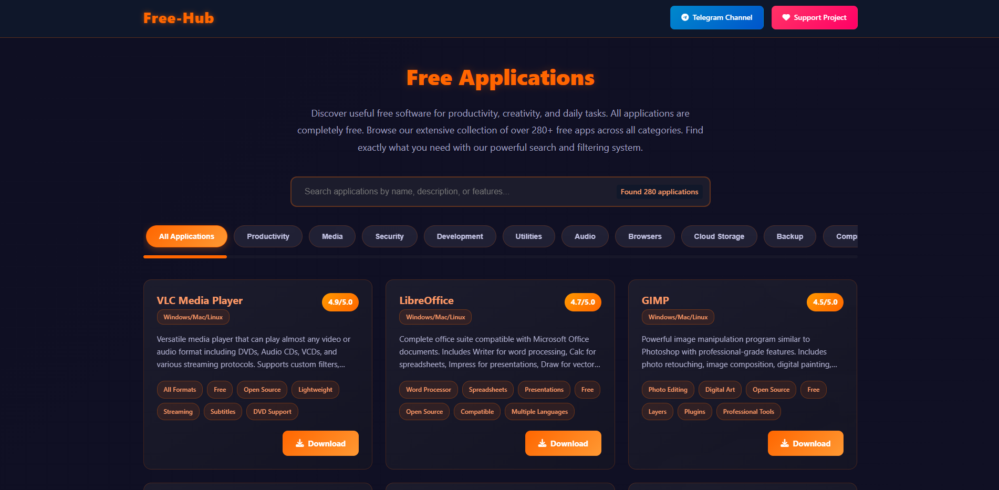

  

# Free-Hub - Free Applications Catalog

### [>> Website <<](https://free-hub.pages.dev/)
### [>> Website (Alternative Link) <<](https://waratecs123.github.io/Free-Hub/)

Free-Hub is a comprehensive web application that serves as a curated catalog of over 280+ completely free software applications across various categories. The platform is designed to help users discover valuable free software for productivity, creativity, development, security, and daily computing tasks.

## Features

### Intelligent Search & Filtering
- **Advanced Search**: Search applications by name, description, or features with real-time results
- **Comprehensive Filtering**: Filter applications across 60+ categories including:
  - Productivity & Development Tools
  - Media & Graphics Software
  - Security & Privacy Applications
  - Audio & Video Utilities
  - System & Network Tools
  - Cloud Storage & Backup Solutions
  - And many more specialized categories

### Application Details
Each application includes:
- **Rating System**: 4.0-5.0 star ratings based on community feedback
- **Platform Information**: Clear indication of supported operating systems
- **Detailed Descriptions**: Comprehensive feature overviews
- **Feature Tags**: Quick-view tags highlighting key capabilities
- **Direct Download Links**: One-click access to official download sources

### Modern User Interface
- **Dark Theme**: Eye-friendly dark color scheme with orange accents
- **Responsive Design**: Fully responsive layout for all device sizes
- **Smooth Animations**: Fade-in effects and hover interactions
- **Visual Feedback**: Glow effects and transitions for better user experience

## Technical Architecture

### Frontend
- **HTML5**: Semantic markup structure
- **CSS3**: Modern styling with gradients, flexbox, and grid layouts
- **JavaScript**: Vanilla JS for dynamic functionality without external dependencies
- **Font Awesome**: Icon library for visual elements
- **Responsive Design**: Mobile-first approach with breakpoints

### Key Technical Features
- **Client-side Filtering**: Instant filtering without page reloads
- **Search Optimization**: Multi-field search across name, description, and features
- **Category Management**: Dynamic category system with active state tracking
- **Performance Optimized**: Minimal dependencies and efficient rendering

## Use Cases

### For End Users
- Discover free alternatives to paid software
- Find specialized tools for specific tasks
- Access vetted, safe download links
- Compare features across similar applications

### For Developers
- Reference implementation of client-side filtering
- Example of vanilla JavaScript application architecture
- CSS design patterns for modern web applications
- Data management patterns for static web apps

## Support the Project

Free-Hub is created and maintained independently. Your support helps keep this resource free and accessible to everyone.

- **[Donation Alerts](https://www.donationalerts.com/r/mobius_org)** – Direct financial support
- **[Telegram Channel](https://t.me/mobius_org)** – Join the community
- **Star on GitHub** – Show your support and help others find the project

## License

This project is open source and available under the [MIT License](LICENSE).

---

**Free-Hub** – Your gateway to the world of free, powerful digital tools. Discover, explore, and enhance your computing experience without cost barriers.
